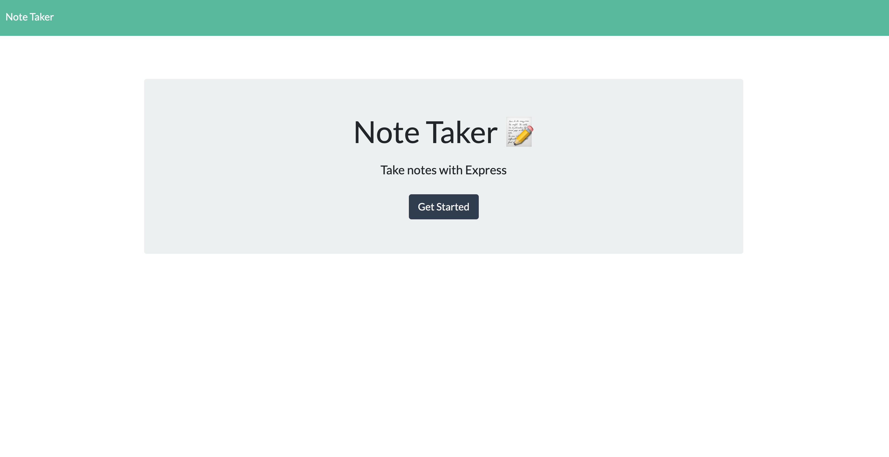
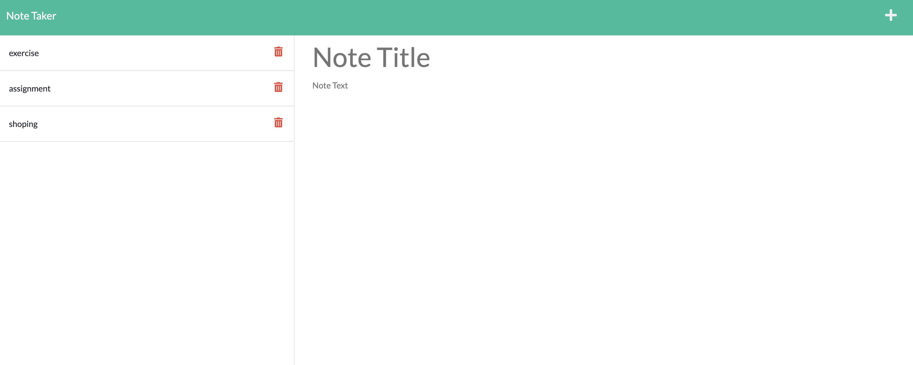
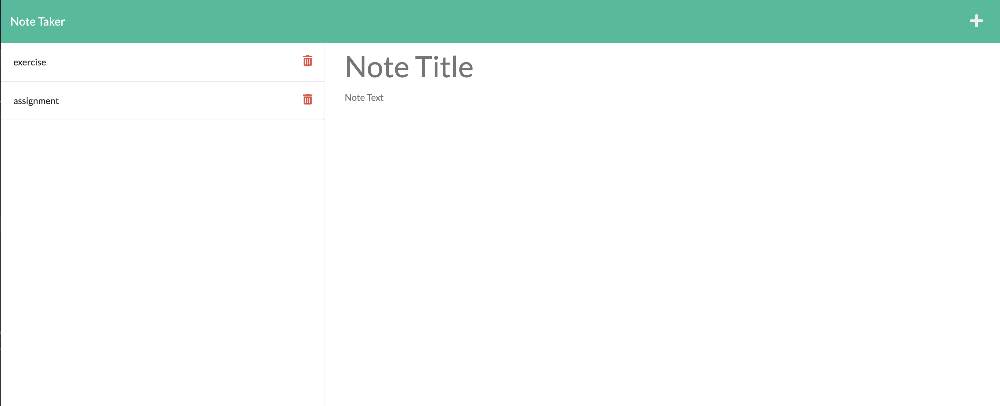

# 11 Express.js: Note Taker

## Your Task

Your assignment is to modify starter code to create an application called Note Taker that can be used to write and save notes. This application will use an Express.js back end and will save and retrieve note data from a JSON file.

The application’s front end has already been created. It's your job to build the back end, connect the two, and then deploy the entire application to Heroku.


## User Story

```
AS A small business owner
I WANT to be able to write and save notes
SO THAT I can organize my thoughts and keep track of tasks I need to complete
```


## Acceptance Criteria

```
GIVEN a note-taking application
WHEN I open the Note Taker
THEN I am presented with a landing page with a link to a notes page
WHEN I click on the link to the notes page
THEN I am presented with a page with existing notes listed in the left-hand column, plus empty fields to enter a new note title and the note’s text in the right-hand column
WHEN I enter a new note title and the note’s text
THEN a Save icon appears in the navigation at the top of the page
WHEN I click on the Save icon
THEN the new note I have entered is saved and appears in the left-hand column with the other existing notes
WHEN I click on an existing note in the list in the left-hand column
THEN that note appears in the right-hand column
WHEN I click on the Write icon in the navigation at the top of the page
THEN I am presented with empty fields to enter a new note title and the note’s text in the right-hand column
```


## Mock-Up

The following images show the web application's appearance and functionality:


## Start
please click in the link below to start the project 
(https://morning-hollows-95473.herokuapp.com/)

## my work
* in the server.js
  *  GET *` return the `index.html` file. 
  *  
  *  `GET /notes` return the `notes.html` file.
  *  

* in the noteRoutes.js file
  * `GET /api/notes`  read the `db.json` file and return all saved notes as JSON.

  * `POST /api/notes`  receive a new note to save on the request body, add it to the `db.json` file, and then return the new note to the client. 
   *  each note a unique id when it's saved.
  * `DELETE /api/notes/:id`  receive a query parameter that contains the id of a note to delete. 

